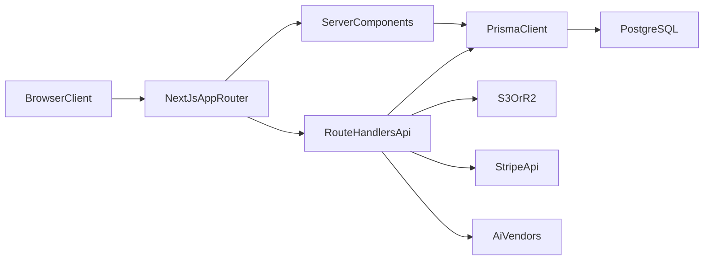

# Site Architecture (Canonical Handoff)

This document is the canonical deep handoff for the Story Sonnet site in this repository.

## 1) Purpose, audience, and scope

- Purpose: explain how the full site is built so a new engineer can safely operate, extend, and debug it.
- Audience: engineers, AI agents, and maintainers working across app, admin, data, and operations.
- Scope: architecture, routes, data model, integrations, security boundaries, deploy/runtime behavior, and change-impact guidance.
- Out of scope: creative writing standards (see `agents/STORY_BIBLE.md`) and step-by-step publish operations (see runbooks linked below).

## 2) Canonical source precedence

When docs disagree, use this precedence:

1. Code in `src/`, `prisma/`, and runtime configs
2. This file (`agents/SITE_ARCHITECTURE.md`)
3. Specialized runbooks in `agents/`

Specialized docs:

- Publish/media ops: `agents/story-sonnet-publish-runbook.md`
- Upload API handoff: `agents/story-sonnet-uploads-agent-handoff.md`
- Admin/Story Studio reference: `agents/story-series-admin-architecture-reference.md`
- Editorial standards: `agents/STORY_BIBLE.md`
- Legacy workflow notes: `agents/story-creation-workflow.md` (legacy-first, not current runtime truth)

## 3) System overview

- Framework: Next.js App Router + React + TypeScript (`package.json`, `src/app`)
- Auth: NextAuth + Prisma adapter (`src/auth.ts`, `src/app/api/auth/[...nextauth]/route.ts`)
- Data: PostgreSQL via Prisma (`prisma/schema.prisma`)
- Storage: S3-compatible object storage (Cloudflare R2 preferred) (`src/lib/s3.ts`)
- Billing: Stripe checkout/portal/webhook (`src/app/api/stripe/*`, `src/lib/stripe-server.ts`)
- Admin suites:
  - Story Library + uploads
  - Story Studio generation
  - Customers CRM
  - Campaigns
  - Content Calendar / spotlights
  - Blog CMS

## 4) Runtime architecture and boundaries

Key boundaries:

- `src/app/**/page.tsx`: route UI (server/client composition)
- `src/app/api/**/route.ts`: server route handlers
- `src/lib/**`: business logic and integration adapters
- `prisma/schema.prisma`: system contract for persisted data

## 5) Route map (full site surface)

### Public and user-facing pages

- `/` (`src/app/page.tsx`)
- `/library` (`src/app/library/page.tsx`)
- `/story/[slug]` (`src/app/story/[slug]/page.tsx`)
- `/pricing`, `/faq`, `/how-it-works`, `/contact`, `/privacy`, `/terms`, `/accessibility`
- `/login`, `/signup`, `/forgot-password`
- `/account`
- `/billing/success`, `/billing/cancel`
- Blog:
  - `/blog`
  - `/blog/[slug]`
  - `/blog/tag/[slug]`
  - `/blog/category/[slug]`
  - `/blog/feed.xml` route handler

### Admin pages

- `/admin` dashboard and nested domains:
  - `/admin/stories`
  - `/admin/uploads`
  - `/admin/story-studio`
  - `/admin/customers`, `/admin/customers/[customerId]`
  - `/admin/campaigns` (+ analytics/settings/placements/promo/trials/notification bars/edit/new)
  - `/admin/content-calendar` (+ spotlights/settings/preview/placements/badge-assets)
  - `/admin/blog` (+ post editor/new/categories/tags/keywords)

### API groups

- Auth/account:
  - `/api/auth/[...nextauth]`
  - `/api/register`
  - `/api/account/avatar`
  - `/api/account/password`
- Billing/Stripe:
  - `/api/create-checkout-session`
  - `/api/create-customer-portal`
  - `/api/stripe/checkout`
  - `/api/stripe/portal`
  - `/api/stripe/webhook`
- Stories/public engagement:
  - `/api/stories/[slug]/library`
  - `/api/stories/[slug]/like`
  - `/api/stories/[slug]/rating`
  - `/api/stories/[slug]/engagement`
  - `/api/stories/[slug]/comments`
  - `/api/stories/[slug]/comments/[id]`
- Media/playback:
  - `/api/upload`
  - `/api/audio/play`
  - `/api/audio/placeholder`
  - `/api/theme-audio/play`
- Campaigns:
  - `/api/campaigns/resolve`
  - `/api/campaigns/events`
  - `/api/campaigns/promo/validate`
  - `/api/campaigns/trial/claim`
- Admin APIs:
  - `/api/admin/stories/**`
  - `/api/admin/covers`
  - `/api/admin/story-studio/**`
  - `/api/admin/customers/**`
  - `/api/admin/campaigns/**`
  - `/api/admin/campaign-analytics/**`
  - `/api/admin/campaign-settings`
  - `/api/admin/content-calendar/**`
  - `/api/admin/blog/**`
  - `/api/admin/notifications`

## 6) Core user and operator flows

### A) Public reading/listening

1. User visits listing (`/` or `/library`)
2. App resolves stories via `fetchStories` in `src/lib/stories.ts`
3. Story page resolves `fetchStoryBySlug`
4. Player payload is transformed by `storyToPlayerPayload`
5. For DB-backed private audio, playback uses `/api/audio/play` signed URLs

### B) Authentication

1. NextAuth handles credentials and optional Google OAuth (`src/auth.ts`)
2. JWT/session callbacks enrich role + subscription status from `Profile`
3. New users get `Profile` bootstrap and admin inbox signup event

### C) Billing

1. Checkout and portal routes create Stripe sessions
2. Stripe webhooks map Stripe status into `Profile.subscriptionStatus`
3. Subscription-active transitions create admin inbox events

### D) Admin publish

1. Upload media via `/admin/uploads` -> `POST /api/upload`
2. Save story/episodes in `/admin/stories` -> `PATCH /api/admin/stories/[id]`
3. Persist `Story.coverUrl` and `Episode.audioStorageKey`
4. Set publish flags on story + episodes

### E) Story Studio generation and sync

1. Draft/preset workflow in `/admin/story-studio`
2. Generation steps write draft assets/jobs
3. Push/sync maps draft output into story upsert path
4. Library rows are updated through same core upsert mechanics as manual edits

## 7) Data architecture (Prisma model domains)

Primary schema: `prisma/schema.prisma`

### Identity and account

- `User`, `Account`, `Session`, `VerificationToken`
- `Profile` for role, subscription, customer state, and operational flags

### Story catalog and playback

- `Story`, `Episode`, `Upload`
- Engagement tables keyed by `storySlug`:
  - `StorySeriesLike`
  - `UserSavedStory`
  - `StorySeriesComment`
  - `StorySeriesRating`

### Story Studio

- `StoryStudioPreset`
- `StoryStudioSettings`
- `StoryStudioDraft`
- `StoryStudioDraftEpisode`
- `StoryStudioGeneratedAsset`
- `StoryStudioGenerationJob`

### CRM and admin notifications

- `CustomerCreditLedger`
- `CustomerAdminNote`
- `CustomerAuditLog`
- `CustomerPurchase`
- `AdminInboxEvent`
- `AdminNotificationSeen`

### Campaigns and content calendar

- `Campaign` + detail tables (`NotificationBarDetail`, `TrialOfferDetail`, `PromoCodeDetail`)
- `CampaignPlacement`, `CampaignSettings`, `CampaignAnalyticsEvent`, `PromoCodeRedemption`, `TrialClaim`, `CampaignStatusHistory`
- `ContentSpotlight`, `ContentSpotlightStory`, `BadgeAsset`, `ContentCalendarSetting`

### Blog CMS

- `BlogPost`, `BlogCategory`, `BlogTag`, `BlogPostTag`
- `BlogKeyword`, `BlogKeywordGroup`
- `BlogAdminSettings`

## 8) Story data truth and fallback behavior

Current canonical truth:

- Runtime catalog truth is PostgreSQL (`Story`, `Episode`) when DB is configured.
- `src/lib/stories.ts` may merge static catalog artifacts (`src/data.js`) as fallback and selective augmentation.

Important behavior:

- Visibility default is `public`; admin views must request `visibility: 'all'`.
- Episode list in public visibility is filtered to `isPublished`.
- `mergeCatalogPublicAudioIntoDbApp` can fill `audioSrc` from static catalog when DB episode lacks both `audioStorageKey` and `audioSrc`.

## 9) Media architecture (covers/audio/theme/transcripts)

- Cover uploads: public object URL stored on `Story.coverUrl`
- Episode audio: private key stored on `Episode.audioStorageKey`
- Theme audio: convention-based keys resolved by theme helpers (not dedicated `Story` columns)
- Transcripts: JSON lines in `Episode.transcriptLines`

Storage adapter: `src/lib/s3.ts`

- Public URLs are generated with configured public origin
- Private playback uses signed URL generation for `audio/mpeg`
- Story delete path removes `covers/<slug>/` and `audio/<slug>/` prefixes

## 10) Integrations

- Stripe:
  - server client in `src/lib/stripe-server.ts`
  - lifecycle sync in `src/app/api/stripe/webhook/route.ts`
- Object storage:
  - `src/lib/s3.ts`
  - route-level usage in `src/app/api/upload/route.ts`
- AI/vendors (Story Studio):
  - OpenRouter (`src/lib/story-studio/openrouter.ts`)
  - ElevenLabs (`src/lib/story-studio/vendors/elevenlabs.ts`)
  - Suno adapter (`src/lib/story-studio/vendors/suno.ts`)

## 11) Security and authorization model

- Route auth is server-side, not only UI-gated.
- Admin routes check `session.user.role === 'admin'` in handlers.
- Middleware (`src/middleware.ts`) only stamps path header; it is not an auth firewall.
- Keep all vendor keys server-only.

## 12) Environment and configuration matrix

Primary references:

- `.env.example`
- `next.config.ts`
- `vercel.json`
- `scripts/prisma-env.mjs`

Subsystem groups:

- Database: `DATABASE_URL`, `DIRECT_DATABASE_URL`
- Auth: `NEXTAUTH_SECRET`, `NEXTAUTH_URL`, optional Google OAuth vars
- Billing: Stripe keys and price ids
- Storage: `R2_*` or fallback `S3_*`, plus public asset base URL
- Story Studio vendor keys: `OPENROUTER_*`, `ELEVENLABS_*`, `SUNO_*`, image generation vars
- Site/public config: `NEXT_PUBLIC_SITE_URL`, image hosts/dev allowed origins

Operational note:

- Keep secrets out of docs and rotate any leaked/committed credentials immediately.

## 13) Deployment, build, and runtime operations

- Build: `npm run build` (includes Prisma generate)
- Runtime: `next start` (Node runtime for key API handlers)
- Vercel config: `vercel.json` with Next.js framework and build command
- Migrations:
  - use `DIRECT_DATABASE_URL` for Neon non-pooler migrate operations
  - runbook contains P1002/P3009 resolution playbooks

## 14) Testing and release verification

Current scripts:

- Lint: `npm run lint`
- Unit tests: `npm run test:unit`

Release smoke checks:

- Auth login/signup
- Checkout + webhook sync to profile
- Upload cover and audio; save and publish story
- Story playback path for subscribed and non-subscribed users
- Admin critical pages load without permission regressions

## 15) Confirmed conflict resolutions

### Upload key behavior (resolved)

Canonical rule from code (`src/app/api/upload/route.ts`, `src/lib/media-upload-keys.ts`):

- If `storySlug` is present (or spotlight/blog slug paths apply), upload leaf file name is randomized via `makeUniqueSafeFileName`.
- Result: repeat uploads under slug paths typically create distinct keys (no overwrite by same original filename alone).
- Stable overwrite behavior applies when slug-based randomization is not triggered and bucket/key match exactly.

This supersedes older runbook text that described slug uploads as always stable-overwrite.

### Legacy content workflow labeling (resolved)

- `agents/story-creation-workflow.md` documents a legacy/public-files-first process (`content/`, `public/audio`, `public/covers`, direct `src/data.js` edits).
- Current production runtime is DB + storage keyed by Prisma models and upload/admin APIs.
- Treat legacy workflow as historical/optional migration context, not canonical runtime behavior.

## 16) Change-impact map (if changing X, also inspect Y)

- Story upsert logic:
  - `src/lib/stories.ts`
  - `src/lib/validation/storySchema.ts`
  - `src/app/api/admin/stories/[id]/route.ts`
- Upload/media key changes:
  - `src/app/api/upload/route.ts`
  - `src/lib/media-upload-keys.ts`
  - `src/lib/s3.ts`
  - `src/app/admin/uploads/page.tsx`
- Playback/entitlement:
  - `src/app/api/audio/play/route.ts`
  - `src/lib/audioEntitlement.ts`
  - `src/lib/stories.ts`
- Auth role/session behavior:
  - `src/auth.ts`
  - `src/app/api/auth/[...nextauth]/route.ts`
  - admin route handlers consuming `auth()`
- Stripe lifecycle:
  - `src/lib/stripe-server.ts`
  - `src/app/api/stripe/webhook/route.ts`
  - pricing/account UI actions
- Content calendar and badge behavior:
  - `src/lib/content-spotlight/*`
  - `src/app/api/admin/content-calendar/*`
  - related Prisma models

## 17) Appendix: quick file index

- App routes: `src/app`
- Core services: `src/lib`
- DB schema: `prisma/schema.prisma`
- Migrations: `prisma/migrations`
- Seeds: `prisma/seed.mjs`
- Operational scripts: `scripts/*`
- Specialized docs:
  - `agents/story-sonnet-publish-runbook.md`
  - `agents/story-sonnet-uploads-agent-handoff.md`
  - `agents/story-series-admin-architecture-reference.md`
  - `agents/STORY_BIBLE.md`
  - `agents/story-creation-workflow.md`
